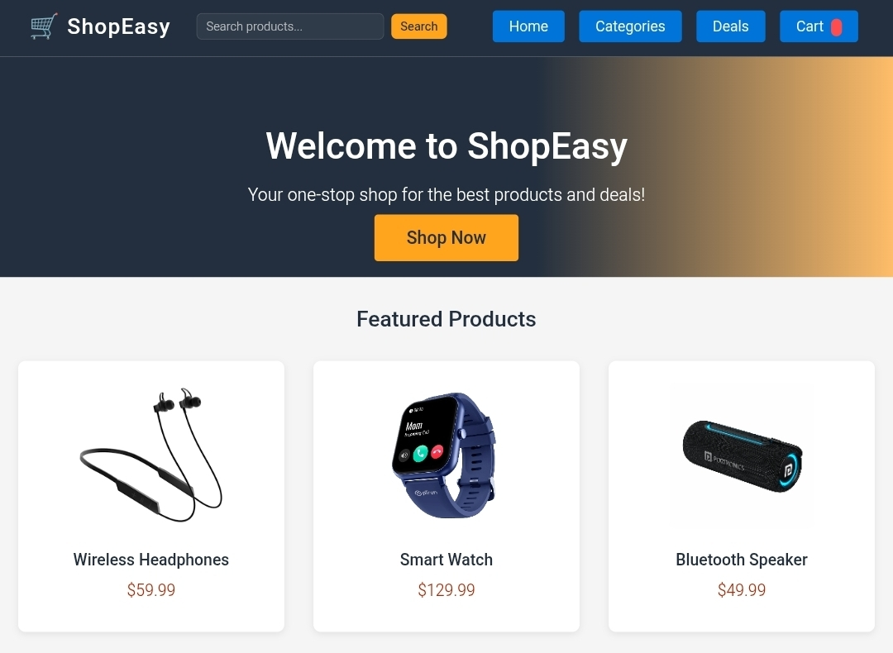

# 🛒 ShopEasy – E-Commerce Product Pages

**ShopEasy** is a responsive and elegant front-end e-commerce website built using **HTML**, **CSS**, and **JavaScript**.  
It showcases product detail pages, including wireless headphones and gaming laptops, with a clean layout and smooth navigation.

---

## 🔗 Live Demo

🌐 **View Project:** [ShopEasy Live](https://prasanthmpp2.github.io/E-commerce_Product_Page/frontpage.html)  
📦 **GitHub Repository:** [E-commerce Product Page](https://github.com/prasanthmpp2/E-commerce_Product_Page)

---

## 📁 Project Structure

```
E-commerce_Product_Page/
│
├── index.html             # Product page for Wireless Headphones
├── product.html           # Generic reusable product page
├── gaming-laptop.html     # Product page for Gaming Laptop
├── frontpage.html         # Homepage for the website
├── styles.css             # Global stylesheet for all pages
├── script.js              # JS for interactive features
└── Photo/                 # Folder containing product images
```

---

## ✨ Features

- 🧩 **Reusable Product Template** – Easily create new product pages.
- 💻 **Responsive Design** – Works across desktops, tablets, and mobiles.
- ⭐ **Ratings & Reviews** – Display star ratings for each product.
- 🛍️ **Add to Cart Button** – Interactive element for cart integration.
- 🎨 **Modern UI/UX** – Clean layout with consistent navigation.
- 🖼️ **High-quality Images** – Visual product display using Unsplash & local images.

---

## 🚀 Getting Started

### 1. Clone the Repository
```bash
git clone https://github.com/prasanthmpp2/E-commerce_Product_Page.git
cd E-commerce_Product_Page
```

### 2. Run the Project
You can open any file directly in your browser (e.g., `index.html` or `frontpage.html`),  
or use **VS Code Live Server** for a smoother preview:
```bash
code .
```
Then click **“Go Live”** to launch the local preview.

---

## 🧩 How to Add a New Product

1. Copy `product.html` and rename it (e.g., `smartwatch.html`).  
2. Replace the image source inside the `` tag.  
3. Update product title, price, and description.  
4. Link your new page to the navigation or homepage.

---

## 🧠 Technologies Used

- **HTML5** – Semantic structure  
- **CSS3** – Responsive design & layout  
- **JavaScript (ES6)** – Interactive UI elements  
- **GitHub Pages** – For live hosting  

---

## 📸 Screenshots

| Page | Preview |
|------|----------|
| Front Page |  |
| Camera |  |
| Gaming Laptop |  |

---

## 👨‍💻 Author

**Prasanth M.P**  
B.E. Computer Science & Engineering (AI & ML)  

- 🔗 [GitHub Profile](https://github.com/prasanthmpp2)

---

## 📄 License

This project is licensed under the **MIT License** — feel free to use and modify it for your own learning and projects.

---

⭐ *If you found this project useful, consider giving it a star on GitHub!*
